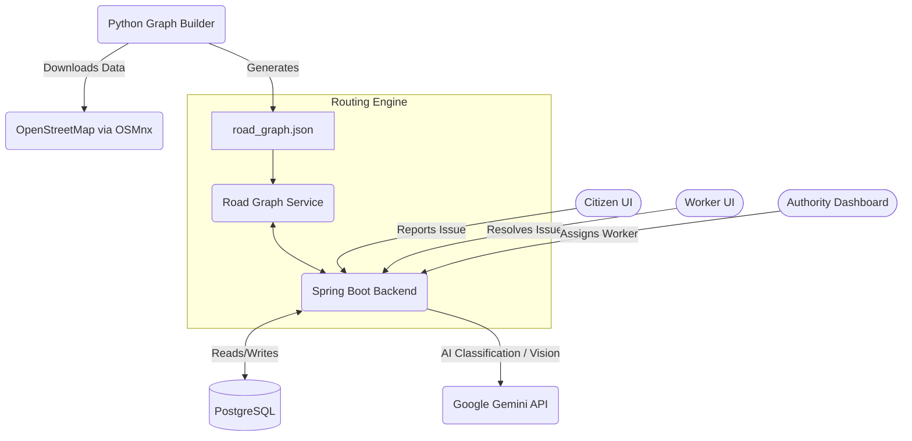

# CivicPulse — Intelligent Civic Issue Lifecycle & Risk-Aware Routing Platform

## Problem Statement
Cities face significant challenges in managing and responding to civic issues like potholes, broken streetlights, and water leaks. Fragmented reporting from citizens often leads to duplicate complaints, while city workers lack optimized tools to prioritize tasks and navigate safely around hazardous areas, resulting in delayed resolutions and wasted resources.

## Proposed Solution
CivicPulse solves these inefficiencies through a unified lifecycle platform that connects citizens directly with city departments and field workers. When a citizen submits an issue, the system leverages AI (Google Gemini) to automatically classify the complaint type, severity, and responsible department. Our intelligent deduplication engine merges overlapping complaints based on spatial and temporal proximity, calculating a dynamic priority score influenced by cluster size, base severity, and age. 

Once a high-priority cluster is verified, authorities can seamlessly assign it to field workers. Workers receive clear, actionable tasks and utilize our custom graph-based routing engine. This routing system shares a common road graph with the issue tracking database, allowing it to dynamically compute both the `FASTEST` path and a `SAFEST` path that actively routes workers around high-severity civic hazards.

Finally, upon task completion, the system uses AI vision to verify the resolution based on before-and-after photos, creating an accountable, end-to-end feedback loop that keeps citizens informed and ensures city resources are deployed effectively.

## Features
- **Mobile-First Citizen Reporting**: Submit issues with photos, descriptions, and GPS coordinates.
- **AI Classification**: Automated detection of issue type, severity, and department using Gemini API with a robust keyword fallback.
- **Intelligent Deduplication**: Spatiotemporal merging of nearby reports to reduce noise and amplify priority.
- **Dynamic Priority Scoring**: Continuous reprioritization based on base severity, cluster size, and time unresolved.
- **Authority Dashboard**: Map-based visualization of open clusters, including heatmap density overlays.
- **Hazard-Aware Routing Engine**: Custom A* implementation offering `fastest` and `safest` routes (avoiding active issue clusters).
- **Worker App View**: Track assigned tasks and mark issues resolved with photos.
- **AI Before/After Verification**: Automatic resolution confidence scoring via Gemini Vision.
- **Reporter Trust Score**: User trustworthiness weights report impact based on past verified submissions.
- **SLA & Accountability**: Automated tracking of target resolution dates based on issue severity.
- **Predictive Alerts**: Open-Meteo integration to warn of flood risks based on expected rainfall and active drainage issues.
- **Citizen Reward Leaderboard**: Gamified point system to encourage civic engagement.
- **AI Voice Complaint Intake**: Web Speech API integration for easy, hands-free reporting.
- **AI Civic Copilot**: Context-aware chat assistant to help citizens navigate the platform and track their issues.

## Tech Stack
- Backend: Java 17, Spring Boot 3, PostgreSQL 15
- Frontend: React 18, Vite, Leaflet.js, Tailwind CSS
- Offline graph preprocessing: Python 3, OSMnx, NetworkX (Brandes' betweenness centrality)
- AI: Google Gemini API (issue classification), with a keyword-based fallback
- Auth: JWT (Spring Security)

## System Architecture

## APIs
| Endpoint | Method | Role | Description |
|----------|--------|------|-------------|
| `/auth/register` | POST | ALL | Register a new user account |
| `/auth/login` | POST | ALL | Authenticate and retrieve JWT token |
| `/api/reports` | POST | CITIZEN | Submit a new civic issue report |
| `/api/reports/mine` | GET | CITIZEN | Fetch all reports submitted by the user |
| `/api/clusters` | GET | ALL | Retrieve all active issue clusters |
| `/api/clusters/{id}` | GET | ALL | Retrieve details for a specific cluster |
| `/api/clusters/{id}/verify` | PATCH | AUTHORITY | Verify AI classification and status |
| `/api/clusters/{id}/assign` | PATCH | AUTHORITY | Assign a worker to the cluster |
| `/api/clusters/{id}/resolve` | PATCH | WORKER | Mark issue as resolved with after-photo |
| `/api/clusters/{id}/suggest-worker` | GET | AUTHORITY | Get ranked worker suggestions |
| `/api/route` | GET | ALL | Calculate route between two coordinates |
| `/api/analytics/heatmap` | GET | AUTHORITY | Fetch heat layer data points |
| `/api/analytics/health-score` | GET | AUTHORITY | Compute ward-level health scores |
| `/api/analytics/alerts` | GET | ALL | Retrieve predictive weather/flood alerts |
| `/api/analytics/leaderboard` | GET | ALL | Fetch top 10 citizens by reward points |
| `/api/copilot/chat` | POST | CITIZEN | Chat with the AI Civic Copilot |

## Database
- **Users**: Core authentication table storing credentials, roles, trust scores, and reward points.
- **Reports**: Individual citizen submissions linked to an issue cluster.
- **Issue_Clusters**: Deduplicated, aggregated groupings of reports acting as the main unit of work.
- **Workers**: Extension of the user table tracking worker coordinates and active task counts.
- **Resolutions**: Records of completed tasks, including before/after photos and AI confidence verification.

## Setup Instructions
**Prerequisites:**
- Java 17+
- Maven
- Node.js 18+
- PostgreSQL 15
- Python 3.10+

**Backend Setup:**
1. Configure `application.yml` with database credentials and Gemini API key.
2. Run `mvn clean compile spring-boot:run` in the `backend` directory.

**Frontend Setup:**
1. Run `npm install` and `npm run dev` in the `frontend-citizen` directory.

**Graph Preprocessing:**
1. Ensure `pip install osmnx networkx geopy` is fulfilled.
2. Run `python fetch_road_graph.py` inside `backend/scripts` to generate the road graph.

## How to Run the Project
1. Start your local PostgreSQL server and create a database named `civicpulse`.
2. Generate the routing graph by executing the Python graph script once.
3. Start the Spring Boot backend (`mvn spring-boot:run`).
4. Start the Vite React frontend(s) (`npm run dev`).
5. Access the app at `http://localhost:5173` and register your demo accounts (one for Citizen, one for Worker, and one for Authority).

## Third-Party APIs, Libraries & Datasets
- OpenStreetMap / Overpass API (via OSMnx) — no key required
- Google Gemini API — optional, keyword fallback included
- Leaflet.js + OpenStreetMap tiles — no key required

## AI-Assisted Development Disclosure
This project was developed with the assistance of AI (Google Antigravity/Gemini). AI was utilized to help rapidly scaffold the Spring Boot backend, generate React boilerplate, write standard utility functions, and integrate external APIs. The overarching system architecture, data schemas, routing logic implementation, and prompt engineering strategies were actively designed and orchestrated by the team.

## Demo Credentials
(No accounts are seeded by default. Please register using the UI with the desired roles):
- Citizen: `demo.citizen@example.com`
- Authority: `demo.authority@example.com`
- Worker: `demo.worker@example.com`

## Deployment
TODO
